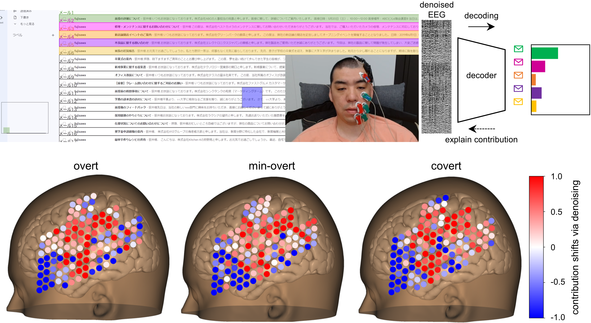

<p align="center">
  
<br />

# Delineating neural contributions to electroencephalogram-based speech decoding

Public repository for Gmail interface papers using uhd-EEG<br>
Author: Motoshige Sato<sup>1</sup>, Yasuo Kabe<sup>1</sup>, Sensho Nobe<sup>1</sup>, Akito Yoshida<sup>1</sup>, Masakazu Inoue<sup>1</sup>, Mayumi Shimizu<sup>1</sup>, Kenichi Tomeoka<sup>1</sup>, Shuntaro Sasai<sup>1*</sup><br>
<sup>1</sup>[Araya Inc.](https://www.araya.org/en/)

## Data

The dataset is hosted on [OpenNeuro (ds007591)](https://openneuro.org/datasets/ds007591).
128-channel EEG recorded during overt, minimally overt, and covert speech production of 5 color words (green, magenta, orange, violet, yellow).

### Download and setup

1. Install the OpenNeuro CLI:
   ```bash
   npm install -g @openneuro/cli
   ```
   Or using [Deno](https://deno.com) (recommended):
   ```bash
   deno install -Agf jsr:@openneuro/cli
   ```

2. Download the dataset into `data/`:
   ```bash
   openneuro download ds007591 data
   ```

3. Extract per-trial epochs from the BIDS EDF files:
   ```bash
   uv run python bids/extract_from_bids.py
   ```
   This creates the per-trial npy files, word lists, and metadata that the preprocessing and training pipelines expect.

### Quick start: loading and visualizing data

```python
import mne
import numpy as np
import pandas as pd

# --- Load a single run from BIDS ---
edf_path = "data/sub-1/ses-20230511/eeg/sub-1_ses-20230511_task-minimallyovert_acq-calibration_run-01_eeg.edf"
events_path = edf_path.replace("_eeg.edf", "_events.tsv")

raw = mne.io.read_raw_edf(edf_path, preload=True, verbose=False)
events_df = pd.read_csv(events_path, sep="\t")
data = raw.get_data()  # (139 channels, n_samples) in Volts

print(f"Channels: {data.shape[0]}, Samples: {data.shape[1]}, Sfreq: {raw.info['sfreq']} Hz")
print(f"Trials: {len(events_df)}")
print(events_df.head())

# --- Extract trial 0 ---
SFREQ = 256
N_CH_TOTAL = 139
EPOCH_SAMPLES = 2880  # 6.25 sec * 256 Hz + margin (packets of 8)

trigger = data[N_CH_TOTAL - 1]
onsets = np.where(np.diff(trigger) > 0.5)[0] + 1
onset_sample = onsets[0]
start = (onset_sample // 8 - 359) * 8
epoch = data[:, start:start + EPOCH_SAMPLES]  # (139, 2880) in Volts

# --- Split into 5 repetitions and average ---
DURA_UNIT = 1.25  # seconds per repetition
samples_per_rep = int(DURA_UNIT * SFREQ)  # 320 samples
eeg_128 = epoch[:128]  # EEG channels only

# Extract the last 1600 samples (5 reps x 320 samples)
eeg_trial = eeg_128[:, -samples_per_rep * 5:]  # (128, 1600)
reps = eeg_trial.reshape(128, 5, samples_per_rep)  # (128, 5, 320)
trial_avg = reps.mean(axis=1)  # (128, 320) - trial-averaged EEG

# --- Show label info ---
WORD_LABELS = {0: "green", 1: "magenta", 2: "orange", 3: "violet", 4: "yellow"}
label = events_df.iloc[0]["value"]
print(f"\nTrial 0: label={label}, color={WORD_LABELS[label]}")
print(f"Trial-averaged EEG shape: {trial_avg.shape}")  # (128, 320)
print(f"  Mean amplitude: {trial_avg.mean():.6e} V")
print(f"  Std amplitude:  {trial_avg.std():.6e} V")
```

## Preparation

1. Install requirements:
   ```bash
   uv sync
   ```

## Usage

1. Save preprocessed EEG/EMG:
   ```bash
   uv run python plot_figures/make_preproc_files.py
   ```
2. Visualization of preprocessing pipeline (Fig. 1):
   ```bash
   uv run python plot_figures/plot_preprocesssing.py
   ```
3. Visualization of volume of speech (Fig. 1) and RMS of EMGs (Fig. 2):
   ```bash
   uv run python plot_figures/plot_rms.py
   ```
4. Quantify the contamination level of EMG to EEG (mutual information, Fig. 2):
   ```bash
   uv run python plot_figures/plot_mis.py
   ```
5. Train decoders. You can specify in `parallel_sets` which subjects and which sessions' data to train:
   ```bash
   uv run python uhd_eeg/trainers/trainer.py -m hydra/launcher=joblib parallel_sets=subject1-1,subject1-2,subject1-3
   ```
6. Copy the trained models and metrics to `data/`
7. Run the inference for online data and evaluate metrics (Table 1, 2, Fig. S1):
   ```bash
   uv run python plot_figures/evaluate_accs.py
   ```
8. Visualization of electrodes used when hypothetically reducing electrode density (Fig. S1):
   ```bash
   uv run python plot_figures/show_montage_decimation.py
   ```
9. Analysis on decoding contributions (integrated gradients, Fig.3-5, Fig.S2):
   ```bash
   uv run python plot_figures/plot_contribution.py
   ```

## For developers

Internal scripts (BIDS conversion, integration tests) require access to raw data on a NAS.
Configure paths by creating a `.env` file in the project root:

```bash
# .env
PARTICIPAT_MAPPING_PATH=/path/to/participant_mapping_gmail.json
RAW_ROOT=/path/to/nas/raw_data
BIDS_ROOT=/path/to/nas/bids_output
OPENNEURO_API_KEY=your_api_key
```

- `RAW_ROOT`: Root directory of the raw EEG data on NAS (contains subject directories)
- `BIDS_ROOT`: Output directory for BIDS conversion on NAS
- `PARTICIPAT_MAPPING_PATH`: Path to the participant name→BIDS ID mapping JSON
- `OPENNEURO_API_KEY`: API key for uploading to OpenNeuro ([get one here](https://openneuro.org/keygen))
