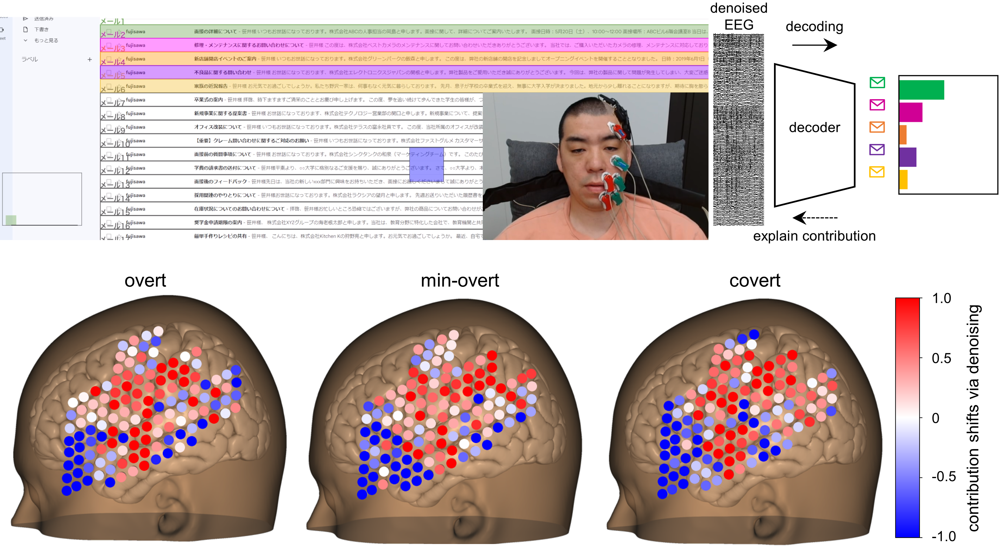

<p align="center">
  
<br />

# Delineating neural contributions to electroencephalogram-based speech decoding

Code for the manuscript "Delineating neural contributions to electroencephalogram-based speech decoding".<br>
Motoshige Sato<sup>1,†,‡</sup>, Eri Hatakeyama<sup>1,‡</sup>, Masakazu Inoue<sup>1</sup>, Yasuo Kabe<sup>1</sup>, Sensho Nobe<sup>1</sup>, Akito Yoshida<sup>1</sup>, Atsushi Yamamoto<sup>1</sup>, Yuya Kita<sup>1</sup>, Mayumi Shimizu<sup>1</sup>, Kenichi Tomeoka<sup>1</sup>, Michael X. Cohen<sup>1</sup>, Shuntaro Sasai<sup>1,*</sup><br>
<sup>1</sup>[Araya Inc.](https://www.araya.org/en/);
<sup>†</sup>present address: University of California, San Francisco;
<sup>‡</sup>equal contribution;
<sup>*</sup>corresponding author

## Install

```bash
uv sync
```

Optional: copy and edit local roots (gitignored):

```bash
cp configs/paths.yaml.example configs/paths.yaml
```

`configs/paths.yaml` sets:

- `bids_root` — OpenNeuro ds007591 download root (`sub-1` … `sub-9`)
- `output_root` — derived per-trial arrays from BIDS extraction (default `data/derived`)

## Data (OpenNeuro ds007591)

Requires **ds007591 version 1.0.3 or later**. Earlier versions have shifted /
incorrect labels in `sub-6_ses-20260518_task-overt_acq-online_run-01_events.tsv`.

```bash
# OpenNeuro CLI (npm or Deno)
npm install -g @openneuro/cli
# or: deno install -Agf jsr:@openneuro/cli

openneuro download ds007591 data/ds007591
```

Point `bids_root` at that directory, then extract per-trial arrays:

```bash
uv run python bids/extract_from_bids.py
```

## Manuscript map (run order)

Scripts produce **data panels** (traces, scatter plots, tables, montages). Final
figure layouts were assembled in presentation software; some labels and scale
bars were adjusted by hand. Underlying numbers come from the commands below.

| # | Item | Command | GPU |
|---|---|---|---|
| 0a | Install | `uv sync` | no |
| 0b | Paths | copy `configs/paths.yaml.example` → `configs/paths.yaml` | no |
| 0c | Download | `openneuro download ds007591 data/ds007591` (**≥ v1.0.3**) | no |
| 0d | BIDS extract | `uv run python bids/extract_from_bids.py` | no |
| 0e | Preproc caches | `uv run python scripts/figures/make_preproc_files.py` | no |
| 1 | Fig. 1 preprocessing | `uv run python scripts/figures/plot_fig1_preprocessing.py` | no |
| 2 | Fig. 1b voice / Fig. 2a EMG RMS | `uv run python scripts/figures/plot_fig1_fig2_rms.py` | no |
| 3 | Fig. 2 MI montages | `uv run python scripts/figures/plot_fig2_mutual_information.py` | no |
| 4 | Offline 10-fold train (EEGNet / LSTM=`RNN` / CovTanSVM / cBraMod; Table 1) | `uv run python scripts/offline/run_rotating_cv_baseline.py --gpu 0` | **yes** |
| 5 | Online manifest | `uv run python scripts/pseudo_online_test/make_online_manifest.py` | no |
| 6 | Post-hoc online eval (Table 2) | `uv run python scripts/pseudo_online_test/run_rotating_cv_pseudo_online.py --manifest scripts/pseudo_online_test/online_data_manifest.csv --gpu 0` | **yes** |
| 7 | Table 1–2 plots / CSV | `uv run python scripts/figures/evaluate_decoding_accs.py` then `uv run python scripts/figures/plot_table_decoding_accs.py` | no* |
| 8 | ITR (1.8 / 0.9 / 0.15 @ 12.4 s; 3.6 @ 6.25 s) | `uv run python scripts/analysis/compute_manuscript_itr.py` | no |
| 9 | Integrated gradients (Figs. 3–5, S5–S6) | `uv run python scripts/analysis/compute_ig.py --gpu 0` (includes `EMG_EEGNet`) | **yes** |
| 10 | Fig. 3b temporal IG trace | `uv run python scripts/figures/make_temporal_ig_paper_trace.py` | no* |
| 11 | Fig. 3 temporal contribution / Jaccard | `plot_temporal_contribution.py`, `plot_temporal_jaccard_trial_based.py` | no* |
| 12 | Fig. 4 spatial IG / correlations | `plot_eegnet_spatial_contribution.py`, `plot_spatial_correlation_between_tasks.py`, `plot_spatial_contribution_mi_correlation.py` | no* |
| 13 | Fig. 5 adapt-filter shift | `plot_eegnet_wo_adapt_diff_spatial_contribution.py`, `plot_spatial_shift_correlation_between_tasks.py` | no* |
| 14 | Fig. S1 adaptive-filter waveforms | `uv run python scripts/figures/plot_adaptive_filter_waveforms_trace.py` | no |
| 15 | Fig. S2a k-medoids montage | `uv run python scripts/figures/plot_fig_s2a_electrode_montage.py` | no |
| 16 | Fig. S2b offline channel decimation (train) | `uv run python scripts/offline/run_channel_decimation_EEGNet.py --gpu 0` | **yes** |
| 17 | Fig. S2b offline plot | `uv run python scripts/figures/plot_fig_s2b_channel_decimation_offline.py` | no* |
| 18 | Fig. S2b online (manifest + eval + plot) | `make_channel_decimation_manifest.py` → `run_channel_decimation_pseudo_online.py --gpu 0` → `plot_fig_s2b_channel_decimation_online.py` | **yes** / no* |
| 19 | Fig. S3 / S4 inter-subject | `make_intersubject_tables.py` then `plot_intersubject_variability_publication.py` | no |
| 20 | Fig. S5 / S6 (wo-adapt / weighted) | `plot_spatial_correlation_between_tasks_wo_adapt_filt.py`, `weighted_corr.py` helpers | no* |
| 21 | Fig. S7 jitter train | `uv run python scripts/offline/run_jitter_ablation_offline.py --gpu 0` | **yes** |
| 22 | Fig. S7 jitter online eval | `uv run python scripts/pseudo_online_test/run_jitter_ablation_pseudo_online.py --gpu 0` | **yes** |
| 23 | Fig. S7 plot | `uv run python scripts/figures/plot_fig_s7_jitter_ablation.py` | no* |
| 24 | Tables S1 / S2 (cross-modal) | EMG train: `trainer_rotating_test_fold.py decode_from=emg num_channels=3`; then `evaluate_cross_modal_controls.py` (**GPU**), `summarize_supplementary_tables_s1_s2.py` | **yes** / no |
| 25 | Tables S3 / S4 (trial counts) | `uv run python scripts/analysis/count_bids_trials.py --verify-manuscript` | no |

\*Plotters are CPU-only once IG / history / summary CSVs exist.

Fig. 1b is plotted from the derived per-trial voice-volume values in
`data/voice_volume/`. Raw audio recordings are not shared to protect participant
privacy.

Post-hoc online analyses (Table 2, Supplementary Tables S3/S4 and Fig. S7) use the first 50 trials
with a valid word label in each online session, as in the manuscript (the default of
`--max-trials 50`).

### EMG / EOG-input EEGNet (Fig. 3, Table S1)

Fig. 3 EOG / EMG-upper / EMG-lower contributions and the Table S1 EMG-trained
decoder use class `EMGDataset` (`decode_from=emg`, `num_channels=3`; channel
order EOG, EMG upper, EMG lower). Train with:

```bash
uv run python uhd_eeg/trainers/trainer_rotating_test_fold.py \
  decode_from=emg num_channels=3 model_name=EEGNet \
  parallel_sets=<BIDS_parallel_set_key>
```

IG exports label this path as `EMG_EEGNet`. Cross-modal Table S1 evaluation is
`scripts/leave_test/evaluate_cross_modal_controls.py`.

### cBraMod backbone weights

The manuscript fine-tunes the authors' public CBraMod backbone (Wang et al.,
ICLR 2025). Weights are **not** redistributed in this repository. Default
training keeps `cBraMod.use_backbone_weights=true` and loads:

`data/weights/cBraMod/pretrained_weights.pth`
(config key `cBraMod.backbone_weight_path`).

Official source (also linked from
[wjq-learning/CBraMod](https://github.com/wjq-learning/CBraMod)
`pretrained_weights/README.md`):

- https://huggingface.co/weighting666/CBraMod/blob/main/pretrained_weights.pth

Download and verify (SHA-256 matches the file used for the manuscript):

```bash
mkdir -p data/weights/cBraMod
curl -L -o data/weights/cBraMod/pretrained_weights.pth \
  https://huggingface.co/weighting666/CBraMod/resolve/main/pretrained_weights.pth
# SHA-256: 0792cb808c14e6b7a2bb2ce1dff379bc47bc54c49a779825bdfeb33bf8157178
```

On load, the classifier warns if the local file's SHA-256 differs from that
digest.

## Tests

```bash
uv run pytest
```

## Citation

A revised version is currently under peer review; this entry will be updated on publication.

```bibtex
@article{sato2024delineating,
  title={Delineating neural contributions to electroencephalogram-based speech decoding},
  author={Sato, Motoshige and Kabe, Yasuo and Nobe, Sensho and Yoshida, Akito and Inoue, Masakazu and Shimizu, Mayumi and Tomeoka, Kenichi and Sasai, Shuntaro},
  journal={bioRxiv},
  year={2024},
  doi={10.1101/2024.05.09.591996}
}
```

OpenNeuro ds007591, version 1.0.3,
https://doi.org/10.18112/openneuro.ds007591.v1.0.3

For the CBraMod backbone, please also cite:

Wang, J., Zhao, S., Luo, Z., Zhou, Y., Jiang, H., Li, S., Li, T., & Pan, G.
(2025). CBraMod: A Criss-Cross Brain Foundation Model for EEG Decoding.
*The Thirteenth International Conference on Learning Representations (ICLR)*.
https://openreview.net/forum?id=NPNUHgHF2w

## License

Code and documentation in this repository are released under [CC0 1.0](LICENSE)
(Creative Commons Universal / Public Domain Dedication). Dataset licensing
follows the OpenNeuro ds007591 terms.
